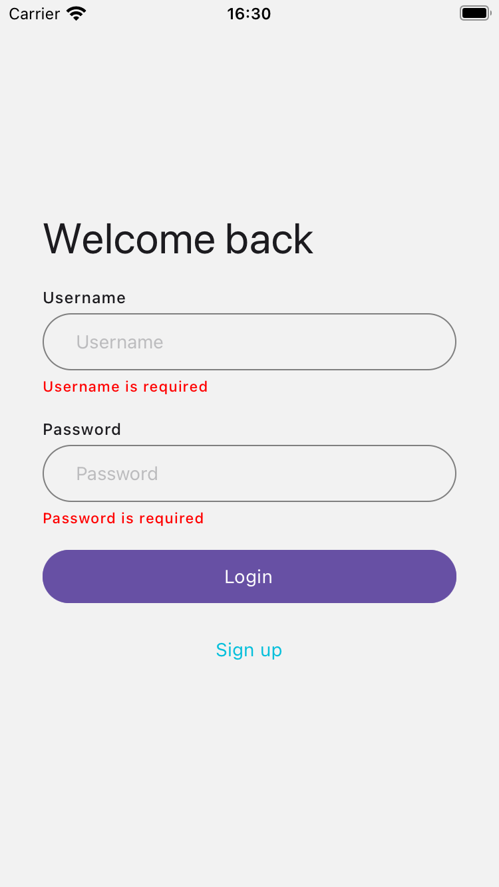
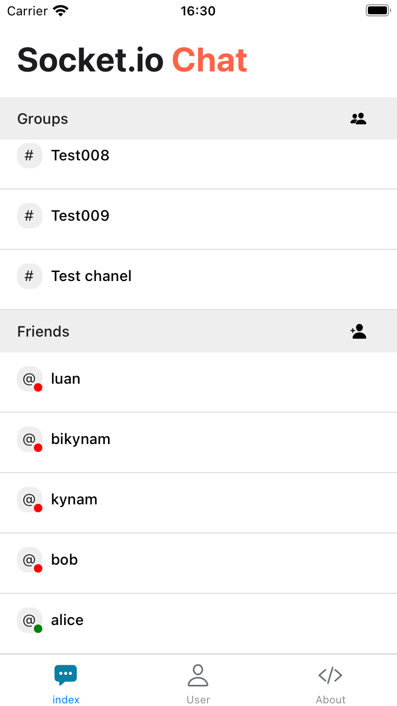
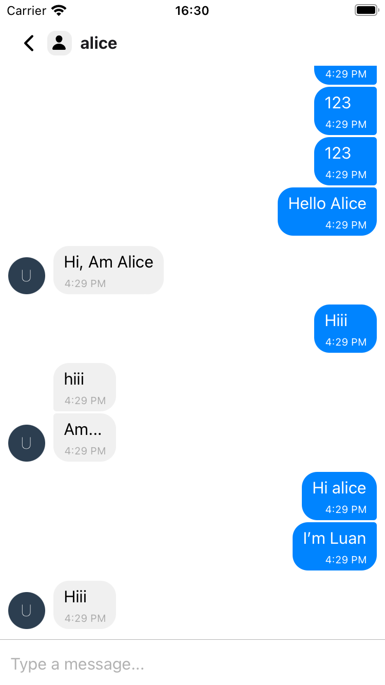

# Welcome to React Native socket.io chat 

This is an React Native socket.io chat example

## Get started

1. Backend  
   We use this [repo](https://github.com/socketio/socket.io-chat-platform) for Backend 

2. Install dependencies

   ```bash
   npm install
   ```

3. Start the app

   ```bash
    npx expo start
   ```

## Get a fresh project

When you're ready, run:

```bash
npm run reset-project
```

This command will move the starter code to the **app-example** directory and create a blank **app** directory where you can start developing.

## Image






